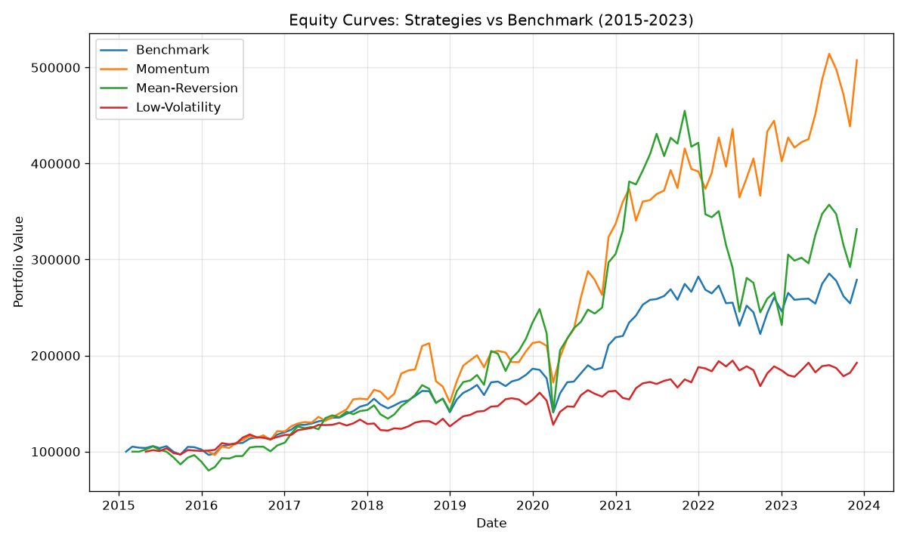

# quant-research

Backtesting and strategy research framework for US equities.

## What it does

Loads historical price data, generates trading signals from a strategy, runs a backtest with transaction costs, and computes performance metrics. Results are stored in SQLite.

## Web dashboard

A FastAPI backend serves the stored backtest results as JSON, and a simple frontend displays them as a table and chart.

Run all strategies and store the results, then start the dashboard:

```
python run_all.py
uvicorn web.app:app --reload
```

Then open http://127.0.0.1:8000 in the browser.

## Pipeline

1. `data/loader.py` - fetches price data via yfinance, stores it in SQLite
2. `strategies/momentum.py` - 12-month momentum signals, rebalanced monthly
3. `backtester/engine.py` - simulates trades with transaction costs
4. `metrics/performance.py` - Sharpe, CAGR, max drawdown
5. `results/store.py` - saves backtest metrics to the database

## Current results

Strategies vs an equal-weight buy-and-hold benchmark on the S&P 500 universe, concentrated 20-stock portfolios, monthly rebalancing (2015-2023):

| Strategy | CAGR | Sharpe | Max Drawdown |
|----------|------|--------|--------------|
| Benchmark (buy & hold) | 12.2% | 0.76 | -24.4% |
| Momentum | 22.8% | 0.95 | -28.9% |
| Mean-Reversion | 14.6% | 0.58 | -49.1% |
| Low-Volatility | 7.9% | 0.63 | -20.7% |



Reading the table:

- **Momentum** is the only strategy that beats the benchmark on a risk-adjusted basis (Sharpe 0.95 vs 0.76). This is consistent with momentum being one of the most robust documented factors.
- **Mean-Reversion** has a slightly higher return than the benchmark but a worse Sharpe and nearly double the drawdown. Risk-adjusted, it does not beat holding the market.
- **Low-Volatility** has the lowest return and the smallest drawdown, as expected for defensive stocks. It does not show the low-volatility anomaly here, likely because 2015-2023 was a strong bull market led by high-growth stocks, an environment where defensive names lag.

The point of this comparison is not to find a winning strategy, but to evaluate each one honestly against a benchmark on a risk-adjusted basis. A high absolute return means little on its own.

## Known limitations

The backtest uses the *current* S&P 500 constituents applied to historical data. Stocks that were in the index during the test period but later dropped out are missing. This is a milder but real form of survivorship bias: the universe is biased toward companies that survived and stayed in the index.

Removing this fully would require point-in-time index membership data, which is not freely available. The current results should be read with this caveat in mind.

## Roadmap

- Expand universe to full S&P 500
- Handle index membership changes over time (avoid survivorship bias)
- Add a mean-reversion strategy for comparison
- Add unit tests

## Stack

Python, SQLite, yfinance, pandas